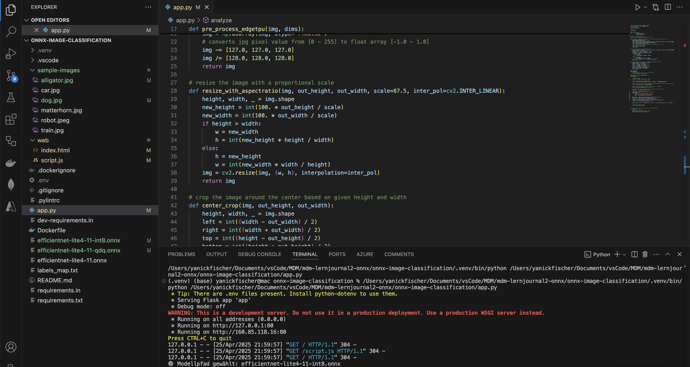
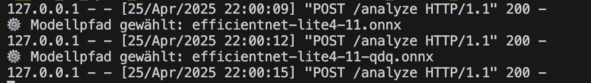

# Efficientnet-lite4 Example Application

# ONNX Image Classification – EfficientNet-Lite4 Demo

Diese Applikation demonstriert den Einsatz von drei verschiedenen Varianten des ONNX-Modells **EfficientNet-Lite4** zur Bildklassifikation. Ziel ist es, den Einfluss von Modellvarianten auf die Klassifikationsergebnisse zu vergleichen.

Diese Anwendung basiert auf diesem Repo: https://github.com/mosazhaw/onnx-image-classification

## Features

✅ Upload von Bildern (JPEG, PNG)  
✅ Auswahl zwischen drei Modellen:
- `EfficientNet-Lite4`
- `EfficientNet-Lite4-INT8`
- `EfficientNet-Lite4-QDQ`

✅ Anzeige der Top-5-Klassen mit Klassifikationswert  
✅ Kein Seitenreload – direkte Antwort dank asynchronem Request  
✅ Vergleichbarkeit durch Dropdown-Selektor

## Aufbau

- `app.py`: Flask-Backend, verarbeitet Bild & Modellwahl, führt Inferenz aus  
- `web/index.html`: HTML-Oberfläche mit Upload, Dropdown und Ergebnisanzeige  
- `web/script.js`: Steuert die Kommunikation zwischen Frontend und Backend  
- `.onnx`: Enthält die drei ONNX-Modelle zur Klassifikation

## Anwendung

1. Starte `app.py` in einer Python-Umgebung mit `onnxruntime` und `flask`
2. Öffne die Applikation via `http://127.0.0.1:5000`
3. Lade ein Bild hoch
4. Wähle ein Modell und klicke auf **Analyze**

---

### Anpassungen für einfache Model-Selektion
Um die Benutzerfreundlichkeit zu verbessern und einen direkten Modellvergleich zu ermöglichen, wurden verschiedene Code-Anpassungen vorgenommen.  
Neu kann der Benutzer über ein Dropdown-Menü eines von drei EfficientNet-Modellen auswählen und per Klick auf einen "Analyze"-Button die Bildanalyse starten.  
Dadurch ist ein einfacher Wechsel zwischen den Modellen möglich, ohne dass ein Seitenreload oder ein neuer Upload notwendig wird.
Die folgenden Codeanpassungen in `app.py`, `script.js` und `index.html` beschreiben die konkrete Umsetzung dieser Funktionalität.

Dass das funktioniert sieht man auch schon in der Konsole anhand der Konsolen-Ausgabe:
⚙️  Modellpfad gewählt: *HIER STEHT DER MODELLNAME*




#### Anpassungen app.py

Anstatt ein fixes Modell (`efficientnet-lite4-11.onnx`) zu laden, wird nun dynamisch eines von drei EfficientNet-Modellen ausgewählt, basierend auf dem Dropdown-Wert im Frontend.

```python
model_key = request.form.get("model", "default")
model_paths = {
    "default": "efficientnet-lite4-11.onnx",
    "int8": "efficientnet-lite4-11-int8.onnx",
    "qdq": "efficientnet-lite4-11-qdq.onnx"
}
model_path = model_paths.get(model_key, model_paths["default"])
ort_session = onnxruntime.InferenceSession(model_path)
```

#### Anpassungen script.js

1. Es wurde eine neue Funktion "submitForm" eingeführt:
```javascript
function submitForm() {
    const fileInput = document.getElementById("image");
    const modelSelect = document.getElementById("model");

    if (fileInput.files.length !== 1) {
        alert("Bitte genau eine Datei hochladen.");
        return;
    }

    const fileSize = fileInput.files[0].size / 1024 / 1024;
    if (fileSize > 10) {
        alert("Datei zu gross (max. 10Mb)");
        return;
    }
```
2. Weiter wurde die Variabel formData angepasst:
```javascript
const formData = new FormData();
    formData.append("image", fileInput.files[0]);
    formData.append("model", modelSelect.value);
```

#### Anpassungen index.html
1. Neu wurde ein Dropdown-Menü eingeführt, um dem Benutzer die Auswahl zwischen drei verschiedenen EfficientNet-Modellen zu ermöglichen.

```html
<div class="form-group mt-3">
    <label for="model">Select Model:</label>
    <select name="model" id="model" class="form-control">
        <option value="default">EfficientNet-Lite4</option>
        <option value="int8">EfficientNet-Lite4 INT8</option>
        <option value="qdq">EfficientNet-Lite4 QDQ</option>
    </select>
</div>
```
2. Das Formular sendet die Daten nicht mehr automatisch, sondern ruft beim Klick auf den Button eine JavaScript-Funktion auf (submitForm()), um Bild und Modellwahl an den Server zu schicken.
```html
<button type="button" class="btn btn-primary mt-3" onclick="submitForm()">Analyze</button>
```
#### Resultat dieser Anpassungen

**Der User kann nun ganz einfach die Modelle ändern!! :D** 

Das ist möglich dank:

✅ `checkFiles(files)` nur noch für Bildprüfung und Vorschau zuständig.  
✅ `submitForm()` wird erst auf Knopfdruck (Button-Click) ausgeführt.  
✅ Benutzer kann vorher Modell wählen im Dropdown (`#model`).  
✅ Antwort (`/analyze`) wird korrekt als Tabelle angezeigt.  
✅ Kein Seiten-Reload nötig.  
✅ Einfacher und schneller Vergleich der drei EfficientNet-Modelle möglich.  
